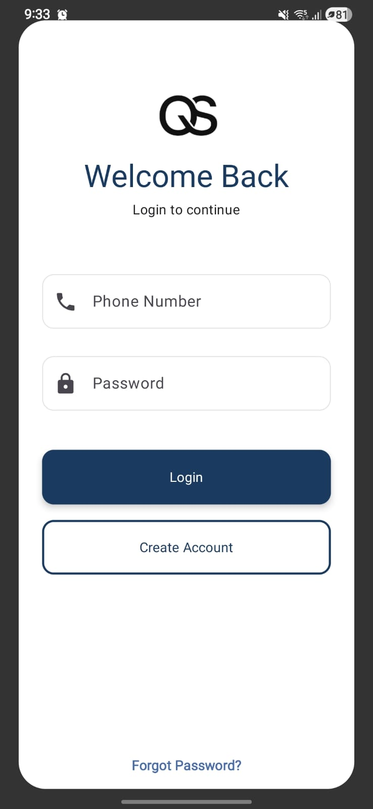
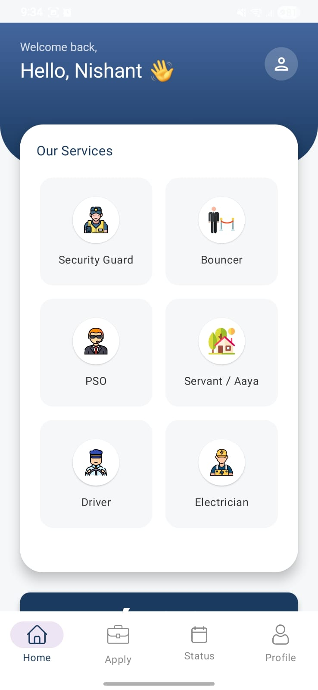

# Quick Safety Service App

A modern Android application built with **Kotlin + Jetpack Compose** for managing service bookings and worker applications for the Quick Safety Service platform.  
The app connects with a Flask/Supabase backend and provides a clean, fast, and easy-to-use interface.

---

## 📸 Screenshots

### **Main Screen**


### **Details Screen**


---

## 🚀 Features

- Clean UI built with **Jetpack Compose**
- User-friendly booking flow
- Worker application form
- API integration with Flask/Supabase backend
- Secure authentication (optional)
- Modern Android architecture using:
  - ViewModel
  - StateFlow
  - Repository pattern

---

## 📦 Installation & Setup

### 1️⃣ Clone the repository

```bash
git clone https://github.com/kazuaki83358/Quick-Safety-Service-App.git
cd Quick-Safety-Service-App

### 2️⃣ screenshots
/images
   ├── image1.jpg
   └── image2.jpg

### 3️⃣ Open project
Open the folder in Android Studio (Giraffe or later).   

### 4️⃣ Build & Run
## Using Gradle:
./gradlew assembleDebug


### 🧩 Project Structure
app/
  ├── data/          # API services + repository
  ├── ui/            # Jetpack Compose screens
  ├── viewmodel/     # State management
  └── utils/         # Helpers & constants

images/
  ├── image1.jpg
  └── image2.jpg
